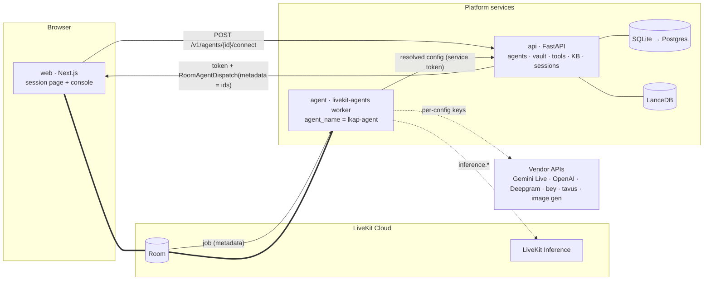

# LiveKit Agent Platform (LKAP)

A reusable, configurable **real-time voice + video agent platform on LiveKit Cloud**. Teams build their own agents in a web console — pick a realtime speech-to-speech model (Gemini Live, OpenAI Realtime) or a cascaded STT → LLM → TTS pipeline (LiveKit Inference works with LiveKit credentials alone), optionally add an avatar (Beyond Presence, Tavus), paste credentials, write instructions, attach tools (HTTP/JSON-schema, MCP, code packs), upload knowledge bases, enable camera and screen share, and get a live session page with a pack-defined panel that the agent updates as it talks.

The reference pack is the **insurance claim live agent** (voice intake, camera evidence pinned with confirmed/unconfirmed captions, incident sketches, policy verification, background claim workflow producing routing, missing items and an adjuster packet).

Status: **v2 in integration** (Phase 1, `docs/v2/PLAN-V2.md`). On top of the v1 MVP, v2 adds:
- every LiveKit provider and avatar is configurable from the console, through a 121-entry registry;
- LiveKit connections, Cloud or self-hosted, with a worker supervisor that runs per-connection pools;
- sign-in, workspaces, roles and API keys;
- a no-code panel of blocks;
- a flow builder;
- a text test mode with rewind, and an embeddable widget;
- telephony over LiveKit SIP, with a default-deny dialing policy;
- QA scoring, recordings, cost lines and webhooks.

`docs/RUNBOOK.md` is the operator guide: running, connections, the supervisor, images, backups, key rotation and the smoke test. `docs/v2/README.md` indexes the v2 design. `docs/REVIEW-FINAL.md` is the v1 pre-handoff review.

## Architecture



Key design points (details in `docs/ARCHITECTURE.md`):
- One worker deployment; the agent config is selected per job from dispatch metadata that carries **IDs only**; the worker fetches the resolved config (with decrypted credentials) from the api. Secrets never reach the browser.
- A single provider registry (`contracts/`) drives both the console forms and the worker's provider factory.
- Packs plug in instructions, code tools, background workflows, KB seeds and a UI panel; the agent ↔ UI protocol is LiveKit text/byte streams + RPC (`lkap.*` topics).
- Vision works in both modes: realtime models get frames natively; cascaded pipelines get one frame injected per user turn plus `describe_current_frame`/`pin_frame` tools.

## Repository

| Path | What |
|---|---|
| `contracts/` | `lkap_contracts`: provider registry, agent config, flows, panel blocks and their config schemas, dispatch metadata, UI protocol, API models, built-in tool names; generated JSON and TS |
| `agent/` | LiveKit worker (`lkap_agent`) |
| `api/` | FastAPI control plane (`lkap_api`): auth/tenancy, connections, fleet, flows, telephony, jobs, webhooks |
| `supervisor/` | Worker supervisor (`lkap_supervisor`): reconciles `supervised` pools as subprocesses or Docker containers |
| `packs/` | The `generic` and `insurance_claim` packs |
| `testing/` | `lkap_testing`: the shared in-memory `packs.base` fakes that the agent and pack test suites use (F-18) |
| `web/` | Next.js session surface, widget and admin console |
| `deploy/`, `scripts/` | Dockerfiles, dev/prod compose, dev scripts, `backup.sh`, `smoke_v2.sh` |
| `docs/` | v1 `ARCHITECTURE.md`, `CONTRACTS.md` and `RUNBOOK.md`; v2 design under `docs/v2/`; research under `docs/research-v2/` |

## Quickstart (local dev against LiveKit Cloud)

Prerequisites: Python 3.12 + `uv`, Node ≥ 24 + `pnpm`, `lk` CLI (`lk cloud auth`), and `LIVEKIT_URL`, `LIVEKIT_API_KEY`, `LIVEKIT_API_SECRET` exported in your shell (or in `.claude/launch.json` / a human-created `.env`; each service ships an `env.example`).

```bash
# 1. contracts
cd contracts && uv sync && uv run python -m lkap_contracts.export && cd ..

# 2. api  (generate a master key once, keep it in your env)
cd api && uv sync && uv run python -m lkap_api.keys generate
LKAP_MASTER_KEY=<key> LKAP_ADMIN_TOKEN=dev-admin LKAP_SERVICE_TOKEN=dev-service \
  uv run alembic upgrade head && \
LKAP_MASTER_KEY=<key> LKAP_ADMIN_TOKEN=dev-admin LKAP_SERVICE_TOKEN=dev-service \
  uv run uvicorn lkap_api.main:app --reload --port 8080
# → http://localhost:8080/docs

# 3. agent worker (new terminal)
cd agent && uv sync
LKAP_API_BASE_URL=http://127.0.0.1:8080 LKAP_SERVICE_TOKEN=dev-service \
  uv run python -m lkap_agent.main dev
# (LIVEKIT_AGENT_NAME is optional: the worker registers as "lkap-agent" by code — D-W2-11)

# 4. web (new terminal)
cd web && pnpm install
NEXT_PUBLIC_API_BASE_URL=http://localhost:8080 LKAP_ADMIN_TOKEN=dev-admin pnpm dev
# → http://localhost:3000/console  → create an agent from the "insurance_claim" pack
#   (default pipeline: LiveKit Inference, no vendor keys needed) → Publish → Test call
```

On first start the api creates:
- the default workspace;
- an owner (`owner@local`, which **you** give a password; RUNBOOK §2);
- a default LiveKit connection from your `LIVEKIT_*`.

In dev, the web proxy signs you in with the break-glass `LKAP_ADMIN_TOKEN`. To run workers under the supervisor instead of by hand, see RUNBOOK §3–§4. `LKAP_PACKS` must be the same on the api and every worker.

**Smoke test:** `scripts/smoke_v2.sh` runs compose dev, a connection, a generic agent and a text round trip. It needs Docker. `--dry-run` makes read-only checks against a running api.

Select Gemini Live in the agent's Providers tab after saving a Google API key credential; select an image-gen credential to enable incident sketches.

## Screenshots

The console and session pages are verified working end-to-end against the local `sqlite` backend (agents CRUD, sessions list/detail, provider validation) — see `docs/RUNBOOK.md` for the LiveKit Cloud voice-call walkthrough, which is where the pages below get exercised live. To capture these for real (e.g. after a `docs/RUNBOOK.md` pass), run the console per Quickstart and save PNGs under `docs/screenshots/`, then reference them here:

| Page | File | What it shows |
|---|---|---|
| `/console` agents list | `docs/screenshots/agents-list.png` | Draft vs. published agents, pack, mode |
| `/console/agents/[id]` — Providers tab | `docs/screenshots/agent-providers.png` | Pipeline mode switch, per-slot provider + model combobox (shows the "vision" hint from `ModelSpec.supports_video`, D-W2-10) |
| `/console/agents/[id]` — Panel tab | `docs/screenshots/agent-panel.png` | Camera/screen-share/chat toggles; the text-only-LLM warning banner when a cascaded LLM without vision is paired with camera/screen share |
| `/console/sessions` | `docs/screenshots/sessions-list.png` | Status badges plus the muted "never started"/"summary never received" chip the stale-session sweep produces (D-W2-2) |
| `/console/sessions/[id]` | `docs/screenshots/session-detail.png` | Usage totals as labeled tiles, transcript, and the tool-call timeline with duration/status badges |
| `/s/[slug]` | `docs/screenshots/session-live.png` | The live voice session page with the pack's panel (insurance notebook) |

`docs/screenshots/` is not committed with placeholder images — add real ones once a session has been run so they reflect actual data rather than a mocked/staged UI.

## Quality gates

Each Python package (`contracts`, `api`, `agent`, `packs`, `supervisor`, `testing`):
```bash
uv run ruff check . && uv run ruff format --check . && uv run mypy src/ --strict && uv run pytest -q -m "not live"
```
`-m live` runs the LiveKit Cloud tests.

Web: `pnpm lint && pnpm typecheck && pnpm test`. After any contracts change, run `scripts/export_contracts.sh --generate`. CI runs the same gates (`.github/workflows/`), plus the api suite and a migration round trip on Postgres.

## Deployment

**Workers:**
- A LiveKit Cloud-hosted pool uses the deploy bundle from a connection's page (`lk agent create` / `lk agent deploy`).
- Self-run pools use the `lkap-agent:slim|full` images under the supervisor.

**Platform:** api, web, supervisor, Postgres, Redis and MinIO run under `deploy/docker-compose.prod.yml`, behind Caddy.

See `deploy/README.md` §4 and `docs/RUNBOOK.md` §3–§7. No image has been built on the dev host yet (Docker not running), so treat the images as "build unverified" until CI or a local `docker build` has passed.

## Connect an AI coding agent

`mcp/` (`lkap-mcp`) is an MCP server for Claude Code, Codex CLI, Cursor or
any other MCP-capable agent: a typed client of this repo's own `/v1` api
that lets an agent understand the platform (a guide, concept docs, recipes
and the generated provider/schema/tool catalog, all served as MCP resources
and tools) and configure it (connections, agents, knowledge bases, tools,
webhooks, plus a text test chat run over the LiveKit room). See
`docs/v3/AGENT-ACCESS.md` for the design and `mcp/README.md` for install
instructions once V3-01/V3-05 land; the console's **Settings → AI agents**
tab (V3-04) mints a scoped key and the exact `claude mcp add` / Codex /
Cursor snippet for you. Once connected, ask the agent to call `lkap_guide`
first — it explains the object model, the workflow and the safety rules
before it touches anything.
