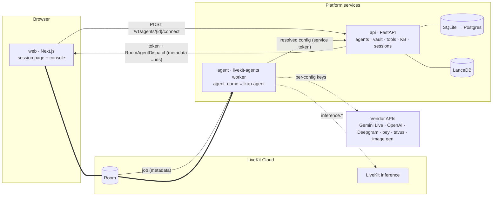

# LiveKit Agent Platform (LKAP)

A reusable, configurable **real-time voice + video agent platform on LiveKit Cloud**. Teams build their own agents in a web console — pick a realtime speech-to-speech model (Gemini Live, OpenAI Realtime) or a cascaded STT → LLM → TTS pipeline (LiveKit Inference works with LiveKit credentials alone), optionally add an avatar (Beyond Presence, Tavus), paste credentials, write instructions, attach tools (HTTP/JSON-schema, MCP, code packs), upload knowledge bases, enable camera and screen share, and get a live session page with a pack-defined panel that the agent updates as it talks.

The reference pack is the **insurance claim live agent** (voice intake, camera evidence pinned with confirmed/unconfirmed captions, incident sketches, policy verification, background claim workflow producing routing, missing items and an adjuster packet).

Status: MVP; see `docs/RUNBOOK.md` for what was verified live and `docs/REVIEW-FINAL.md` for the pre-handoff review.

## Architecture



Key design points (details in `docs/ARCHITECTURE.md`):
- One worker deployment; the agent config is selected per job from dispatch metadata that carries **IDs only**; the worker fetches the resolved config (with decrypted credentials) from the api. Secrets never reach the browser.
- A single provider registry (`contracts/`) drives both the console forms and the worker's provider factory.
- Packs plug in instructions, code tools, background workflows, KB seeds and a UI panel; the agent ↔ UI protocol is LiveKit text/byte streams + RPC (`lkap.*` topics).
- Vision works in both modes: realtime models get frames natively; cascaded pipelines get one frame injected per user turn plus `describe_current_frame`/`pin_frame` tools.

## Repository

| Path | What |
|---|---|
| `contracts/` | `lkap_contracts` — provider registry, agent config, dispatch metadata, UI protocol, API models; generated JSON + TS |
| `agent/` | LiveKit worker (`lkap_agent`) |
| `api/` | FastAPI control plane (`lkap_api`) |
| `packs/` | `generic` and `insurance_claim` packs |
| `web/` | Next.js session surface + admin console |
| `deploy/`, `scripts/` | Dockerfiles, compose, dev scripts |
| `docs/` | `ARCHITECTURE.md`, `CONTRACTS.md`, `INSURANCE_PACK_MAPPING.md`, `IMPLEMENTATION_PLAN.md`, `research/` |

## Quickstart (local dev against LiveKit Cloud)

Prerequisites: Python 3.12 + `uv`, Node ≥ 24 + `pnpm`, `lk` CLI (`lk cloud auth`), and `LIVEKIT_URL`, `LIVEKIT_API_KEY`, `LIVEKIT_API_SECRET` exported in your shell (or in `.claude/launch.json` / a human-created `.env`; each service ships an `env.example`).

```bash
# 1. contracts
cd contracts && uv sync && uv run python -m lkap_contracts.export && cd ..

# 2. api  (generate a master key once, keep it in your env)
cd api && uv sync && uv run python -m lkap_api.keys generate
LKAP_MASTER_KEY=<key> LKAP_ADMIN_TOKEN=dev-admin LKAP_SERVICE_TOKEN=dev-service \
  uv run alembic upgrade head && \
LKAP_MASTER_KEY=<key> LKAP_ADMIN_TOKEN=dev-admin LKAP_SERVICE_TOKEN=dev-service \
  uv run uvicorn lkap_api.main:app --reload --port 8080
# → http://localhost:8080/docs

# 3. agent worker (new terminal)
cd agent && uv sync
LKAP_API_BASE_URL=http://127.0.0.1:8080 LKAP_SERVICE_TOKEN=dev-service \
  uv run python -m lkap_agent.main dev
# (LIVEKIT_AGENT_NAME is optional: the worker registers as "lkap-agent" by code — D-W2-11)

# 4. web (new terminal)
cd web && pnpm install
NEXT_PUBLIC_API_BASE_URL=http://localhost:8080 LKAP_ADMIN_TOKEN=dev-admin pnpm dev
# → http://localhost:3000/console  → create an agent from the "insurance_claim" pack
#   (default pipeline: LiveKit Inference, no vendor keys needed) → Publish → Test call
```

Select Gemini Live in the agent's Providers tab after saving a Google API key credential; select an image-gen credential to enable incident sketches.

## Screenshots

The console and session pages are verified working end-to-end against the local `sqlite` backend (agents CRUD, sessions list/detail, provider validation) — see `docs/RUNBOOK.md` for the LiveKit Cloud voice-call walkthrough, which is where the pages below get exercised live. To capture these for real (e.g. after a `docs/RUNBOOK.md` pass), run the console per Quickstart and save PNGs under `docs/screenshots/`, then reference them here:

| Page | File | What it shows |
|---|---|---|
| `/console` agents list | `docs/screenshots/agents-list.png` | Draft vs. published agents, pack, mode |
| `/console/agents/[id]` — Providers tab | `docs/screenshots/agent-providers.png` | Pipeline mode switch, per-slot provider + model combobox (shows the "vision" hint from `ModelSpec.supports_video`, D-W2-10) |
| `/console/agents/[id]` — Panel tab | `docs/screenshots/agent-panel.png` | Camera/screen-share/chat toggles; the text-only-LLM warning banner when a cascaded LLM without vision is paired with camera/screen share |
| `/console/sessions` | `docs/screenshots/sessions-list.png` | Status badges plus the muted "never started"/"summary never received" chip the stale-session sweep produces (D-W2-2) |
| `/console/sessions/[id]` | `docs/screenshots/session-detail.png` | Usage totals as labeled tiles, transcript, and the tool-call timeline with duration/status badges |
| `/s/[slug]` | `docs/screenshots/session-live.png` | The live voice session page with the pack's panel (insurance notebook) |

`docs/screenshots/` is not committed with placeholder images — add real ones once a session has been run so they reflect actual data rather than a mocked/staged UI.

## Quality gates

Each Python package: `uv run ruff check . --fix && uv run ruff format . && uv run mypy src/ --strict && uv run pytest -x -v` (offline; `-m live` for LiveKit Cloud tests). Web: `pnpm lint && pnpm typecheck && pnpm test` (`pnpm e2e` is not a gate yet — `web/e2e/` has no specs).

## Deployment

Agent → LiveKit Cloud (`cd agent && lk agent create --secrets-file secrets.env`, then `lk agent deploy`; `livekit.toml` names the agent `lkap-agent`). api + web → containers (`deploy/docker-compose.yml`). See `docs/CONTRACTS.md §12`.
