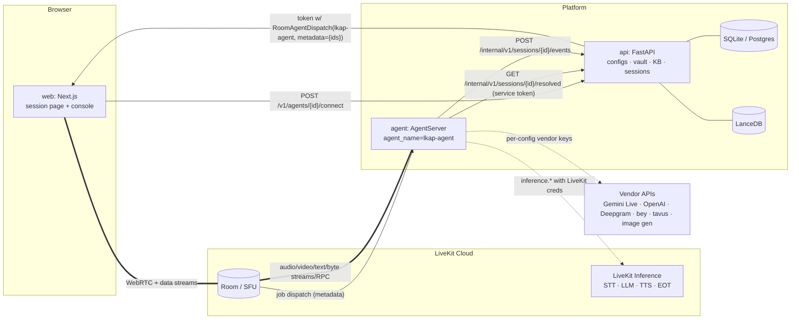
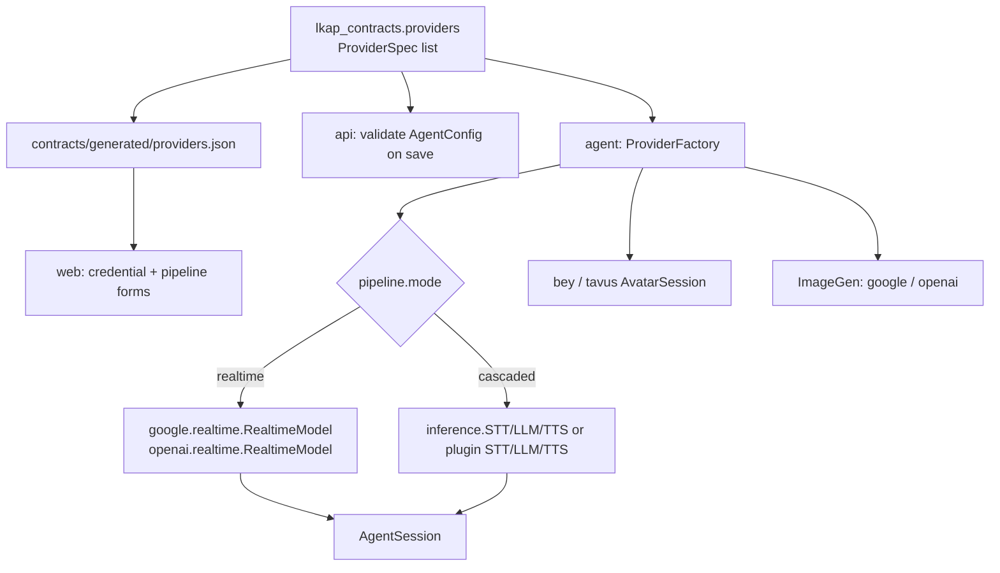
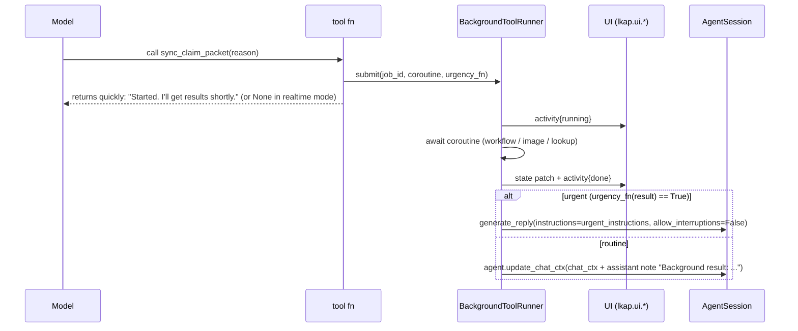

# LiveKit Agent Platform (LKAP) — Architecture

> **Superseded in part (2026-09-18):** `docs/DECISIONS-W2.md` D-W2-9 overrides §4 (start order), §7.4 (KB k), §8 (video source preference, cascaded frame encoding), §9 (`caption`, not `caption_ref`), §11/§12 (test call → console-proxied test mode), §14 (usage from `session_usage_updated`), §15.9 (verified: `say()` needs a TTS); D-W2-9p (typed chat through `on_user_turn_completed`, §9), D-W2-10 (vision capability gate, §8), D-W2-11 (agent name fixed in code), D-W2-12 (`search_knowledge(query)`, §7), D-W2-13 (worker restart/stop rule). Read DECISIONS-W2 first where they differ.

Status: **approved design, contract-first.** Implementers follow `docs/CONTRACTS.md` for exact shapes and `docs/IMPLEMENTATION_PLAN.md` for work packages. This document explains *what* and *why*; it does not repeat every field.

Baseline facts were verified against installed `livekit-agents==1.8.2`, `livekit-plugins-google==1.8.2`, `livekit-api==1.2.1`, `livekit==1.1.18` (rtc), `@livekit/components-react@2.9.24` and `lk` CLI 2.16.2 on 2026-09-17/18 (see `docs/research/*.md`). Anything still unverified is listed in §15.

---

## 1. What LKAP is

A reusable platform for building **real-time voice + video agents on LiveKit Cloud**. A team configures an agent in a web console (providers + credentials, instructions, tools, knowledge bases, UI panel), then opens a live session where the agent listens, talks, watches the camera or screen share, calls tools, and pushes structured state to a pack-defined live panel.

Three deployable services plus shared code:

| Service | Tech | Role |
|---|---|---|
| `agent/` | Python 3.12, `livekit-agents` 1.8.2 | The single LiveKit worker (`AgentServer`, one `rtc_session`). Builds the provider stack per job from the agent config, runs tools, pushes UI state. |
| `api/` | Python 3.12, FastAPI | Admin/config API, credential vault, knowledge-base ingestion, session/token endpoint with explicit dispatch, internal service endpoints for the worker, session/tool-call logs. |
| `web/` | Next.js 15, React 19, Tailwind 4, shadcn + `@agents-ui` | Live session surface and admin/builder console. |
| `contracts/` | Python package `lkap_contracts` + generated JSON/TS | Provider registry, agent config schema, dispatch metadata, agent↔UI protocol, pack manifest. Single source of truth. |
| `packs/` | Python packages | Use-case packs. `packs/insurance_claim` is the reference pack (feature parity with the Gemini Live demo). |

Non-goals for the MVP: multi-tenant auth/RBAC, billing, SIP/telephony, self-hosted LiveKit, OpenTelemetry export, half-cascade pipelines, non-MVP providers (listed in the registry as deferred).

---

## 2. Decision summary (D1–D14)

| # | Decision | Choice | Why (one line) |
|---|---|---|---|
| D1 | Worker topology | One deployment, agent name **`lkap-agent`**, explicit dispatch, config selected inside the single entrypoint from job metadata | `AgentServer` allows exactly one `rtc_session`; explicit dispatch keeps the existing `other-project-agent` untouched. |
| D2 | How the worker gets config | Dispatch metadata carries **IDs only** (`session_id`, `agent_id`, `config_version`); worker fetches the *resolved* config incl. decrypted credentials from `api` with a service token | The dispatch metadata lives inside the JWT the browser holds; secrets must never be there. Fetch also gives one code path for dev and prod. |
| D3 | Session start | Browser → `POST /v1/agents/{agent_id}/connect` (api mints token with `RoomAgentDispatch`); api ignores any client-supplied `roomConfig` | Otherwise a browser could dispatch any agent config. Compatible with `TokenSource.custom()` in `livekit-client`. |
| D4 | Database | **SQLite** (`aiosqlite`) via SQLAlchemy 2 async + Alembic; `DATABASE_URL` switch to Postgres later | Zero-ops for MVP; Alembic + SQLAlchemy keep the schema portable. |
| D5 | Credential encryption | Fernet (`cryptography`) with `LKAP_MASTER_KEY` from env; ciphertext in DB; decrypt only inside the internal resolve endpoint | Simplest correct envelope for MVP; KMS is deferred. |
| D6 | Vector store / embeddings | **LanceDB** (file-based) behind a `VectorStore` Protocol; default embedder **fastembed** (local ONNX `BAAI/bge-small-en-v1.5`); OpenAI embeddings as optional registry entry | Free-tier constraint: KB must work with **no vendor key**. LanceDB needs no server. pgvector/Pinecone deferred behind the Protocol. |
| D7 | Provider registry | Pydantic models in `lkap_contracts.providers` → exported `providers.json` + TS types; drives UI forms *and* the worker factory | One source of truth; adding a provider is one Python entry + one factory branch. |
| D8 | Default dev pipeline | Cascaded via **LiveKit Inference** (`deepgram/nova-3` → `google/gemma-4-31b-it` → `inworld/inworld-tts-2`, `inference.TurnDetector()`); Gemini Live selectable once a Google key is saved | Works with LiveKit creds alone; Google free-tier quota is scarce. |
| D9 | Claim graph | **Port ADK → plain Python**: one JSON-extraction LLM call + verbatim deterministic rules | Removes `google-adk` (heavy, Google-only quota), lets the workflow use whatever LLM the agent is configured with, and enables offline tests with a fake LLM. ADK added nothing beyond sequencing here. |
| D10 | Background ("non-blocking") tools | Tools return quickly; long work runs in a session-scoped task; result delivery: UI topic always; conversation via `reply_required` control (realtime) or `update_chat_ctx` / `generate_reply` (cascaded) | LiveKit has no NON_BLOCKING tool flag; §7 gives both code paths. |
| D11 | Vision | Worker owns a **latest-frame buffer** per track source in both modes; realtime additionally sets `RoomOptions(video_input=True)`; cascaded injects one `ImageContent` per user turn | Verified: `AgentActivity.push_video` only forwards to a realtime session, so cascaded vision must be manual. Pinning needs JPEG bytes anyway. |
| D12 | Agent↔UI transport | Text streams for JSON state/events, byte streams for images, RPC for request/response, `lk.transcription`/`lk.chat` untouched | Matches verified rtc primitives and React hooks (`useTextStream`, `useRpc`; byte streams via `room.registerByteStreamHandler`). |
| D13 | Frontend base | Fresh Next 15 app in `web/`; vendor `@agents-ui` components with `pnpm dlx shadcn@latest add @agents-ui/all`; do **not** fork `agent-starter-react` | The starter's token route is dev-only and its page is single-agent; we need routes for the console and a panel registry. |
| D14 | Auth (MVP) | Static admin bearer token for console/API; per-agent `public` flag for the connect endpoint; static service token for worker→api | Single-operator MVP; real auth is deferred but the middleware seam exists. |

Deferred (explicit): Postgres/pgvector, Pinecone, KMS, OAuth/RBAC, OTel exporter, SIP, half-cascade, avatar providers beyond bey/tavus, MCP stdio servers in prod, recording, multi-region deploy.

---

## 3. Runtime topology



Ports (local dev): web `3000`, api `8080`, agent has no port (`dev` mode connects outbound to LiveKit Cloud).

---

## 4. Session start sequence

```mermaid
sequenceDiagram
  participant U as Browser (web)
  participant A as api
  participant L as LiveKit Cloud
  participant G as agent worker
  U->>A: POST /v1/agents/{agent_id}/connect {participant_name?}
  A->>A: load Agent(agent_id) → must be published or caller has admin token
  A->>A: create Session row (session_id, room_name=lkap-{session_id[:8]}, config_version)
  A->>A: AccessToken.with_room_config(RoomConfiguration(agents=[RoomAgentDispatch(agent_name="lkap-agent", metadata=json(DispatchMetadata))]))
  A-->>U: {serverUrl, participantToken, roomName, sessionId, uiPanelId, capabilities}
  U->>L: room.connect(serverUrl, token) + publish mic (camera/screen on toggle)
  L->>G: job(metadata=DispatchMetadata)
  G->>A: GET /internal/v1/sessions/{session_id}/resolved  (X-Service-Token)
  A-->>G: ResolvedAgentConfig (instructions, pipeline, decrypted credentials, tools, kbs, pack, panel)
  G->>G: ProviderFactory.build(pipeline) → AgentSession; PackRuntime.load(pack); tools; KB; avatar?
  G->>L: avatar.start() (if configured) → session.start(room, agent, room_options)
  G->>L: send_text(topic=lkap.ui.state, UiSnapshot v1 seq=1)
  G->>L: say(greeting) / generate_reply(instructions=greeting_instructions)
  G->>A: POST /internal/v1/sessions/{id}/events (session_started)
  Note over U,G: conversation: audio both ways, lk.transcription → UI, lk.chat → agent, lkap.* topics for panel
  U->>L: disconnect (End call button) or agent tool end_call
  G->>A: PUT /internal/v1/sessions/{id}/summary (usage, transcript, final UI state)
```

Rules:
- `DispatchMetadata` is **IDs only** (`docs/CONTRACTS.md §6`). It is readable by the browser (inside the JWT). Never put instructions, keys, or tool config there.
- The worker calls `ctx.connect()` *after* fetching config so that a bad config fails the job cleanly (`ctx.shutdown(reason=...)`) without the user ever hearing a half-configured agent. If the resolve call fails, the worker connects, speaks a fixed "configuration unavailable" line via a minimal Inference TTS, logs, and shuts down.
- The api validates the config at **save time** (registry validation) *and* the worker re-validates at **resolve time** (`ResolvedAgentConfig` Pydantic model), so a stale row cannot crash the entrypoint.

---

## 5. Data model and storage

Entities (full DDL in `CONTRACTS.md §5`):

- `agents` — name, slug, `published`, `pack_id`, `ui_panel_id`, `config` (JSON `AgentConfig` v1), `config_version` (int, bumped on save), timestamps.
- `credentials` — `provider_id`, `label`, `ciphertext` (Fernet of JSON `{field: value}`), `fingerprint` (last 4 chars for display), timestamps. Agents reference credentials by id inside `config.pipeline.*.credential_id`.
- `tools` — declarative tool definitions (`kind`: `http` | `mcp`), `definition` JSON, owned per agent or shared (`agent_id` nullable).
- `knowledge_bases`, `kb_documents`, `kb_chunks` — KB metadata, uploaded docs (stored on disk under `LKAP_DATA_DIR/kb/{kb_id}/`), chunk rows mirrored to LanceDB (`table = kb_{kb_id}`).
- `sessions` — `agent_id`, `config_version`, `room_name`, `participant_identity`, `status`, `started_at/ended_at`, `usage` JSON, `final_ui_state` JSON, `transcript` JSON.
- `session_events` — append-only: `tool_call_started/ended`, `ui_state`, `agent_state`, `error`, `metrics` with JSON payload.

Storage: SQLite file at `LKAP_DATA_DIR/lkap.db`; Alembic migrations in `api/alembic/`. Postgres works by changing `DATABASE_URL` (no SQLite-only types; JSON columns use `sa.JSON`).

Vector store: `VectorStore` Protocol (`upsert(chunks)`, `query(kb_id, text, k)`, `delete(kb_id)`), LanceDB implementation at `LKAP_DATA_DIR/lancedb/`. Embedder: `Embedder` Protocol, default `FastEmbedEmbedder` (local ONNX, ~130 MB model cached under `LKAP_DATA_DIR/models/`). The worker queries the KB through the api (`POST /internal/v1/kb/{kb_id}/search`) so LanceDB files have a single writer/reader process.

Master key: `LKAP_MASTER_KEY` (urlsafe base64, 32 bytes). Generated once with `python -m lkap_api.keys generate` and placed in the launch config / secrets. Rotation is deferred (documented procedure: re-encrypt via a management command).

---

## 6. Provider registry and factory



`ProviderSpec` (see CONTRACTS §4) has: `id`, `kind` (`realtime|stt|llm|tts|avatar|image_gen|embedding`), `package`, `python_class`, `secret_fields`, `fields` (typed, with defaults/enums/conditions), `models` (suggested list, not an allowlist), `requires_credential` (false for `livekit-inference-*`), `capabilities` (`video_input`, `tool_calling`, `silent_tool_reply`).

Initial entries (MVP): `livekit-inference-stt`, `livekit-inference-llm`, `livekit-inference-tts`, `google-realtime`, `openai-realtime`, `deepgram-stt`, `openai-llm`, `google-llm`, `cartesia-tts`, `elevenlabs-tts`, `openai-tts`, `bey-avatar`, `tavus-avatar`, `google-image-gen`, `openai-image-gen`, `fastembed-embedding`, `openai-embedding`. Everything else in the research catalog is `status: "deferred"` in the registry: deferred entries are kept as data, but the console currently hides them (the `status === "mvp"` filter in `providers-tab.tsx`/`provider-slot-editor.tsx`), so nothing shows a "coming soon" entry yet (REVIEW-FINAL F-25).

Factory rule: the factory only ever passes credentials as explicit constructor kwargs (`api_key=...`) from the resolved config. It never sets process env vars, so two jobs with different keys in the same worker cannot leak into each other. Inference classes get the worker's own `LIVEKIT_API_KEY/SECRET` from env (that is how Inference is billed).

Gemini Live specifics: registry exposes `tool_behavior` (`BLOCKING|NON_BLOCKING`, default `NON_BLOCKING`) and `tool_response_scheduling` (`WHEN_IDLE|INTERRUPT|SILENT`, default `WHEN_IDLE`) because silent tool replies only work when `tool_behavior == NON_BLOCKING` and not on Vertex (verified in plugin source). `modalities` is fixed to `["AUDIO"]` for MVP.

---

## 7. Tools: registration, background execution, reply control

### 7.1 Tool sources

| Source | Defined by | Built with | Notes |
|---|---|---|---|
| Built-in standard tools | platform (`agent/src/lkap_agent/tools/builtin/`) | typed `@function_tool` | Always available; agent config can disable individual ones (`tools.builtin_disabled`). |
| HTTP/webhook tools | admin UI → `tools` table (`kind: http`) | `function_tool(handler, raw_schema=...)` with a generic handler that receives `raw_arguments` and `RunContext`, renders the URL/body template, calls `httpx`, returns text/JSON (truncated to `max_result_chars`) | Outbound allowlist: URL host must match `tool.definition.allowed_hosts` or the platform `LKAP_HTTP_TOOL_ALLOWED_HOSTS`. |
| MCP servers | admin UI → `tools` table (`kind: mcp`) | `mcp.MCPServerHTTP(url, headers, transport_type="streamable_http", allowed_tools=...)` passed to `Agent(mcp_servers=[...])` | Stdio MCP is deferred (needs a process sandbox). |
| Pack code tools | pack Python package | typed `@function_tool` methods returned by `Pack.tools(ctx)` | Full access to `PackSessionContext` (frame buffer, UI channel, KB client, workflow runner). |

All tool invocations are logged at DEBUG with `{session_id, tool, call_id, args_redacted, duration_ms, status}` and mirrored to the UI activity topic and the api events endpoint.

### 7.2 Background tools (replaces Gemini `NON_BLOCKING` + `WHEN_IDLE` / `INTERRUPT`)

LiveKit has no non-blocking tool flag. Verified semantics:
- A tool's return value becomes a `FunctionCallOutput`; `reply_required` defaults to `True`, is set to `False` when the tool returns `None` or raises `StopResponse`, and is **honoured by realtime models** (Gemini Live, OpenAI Realtime), **and by the cascaded pipeline from livekit-agents 1.8.3**. Below 1.8.3 a cascaded LLM answers every tool output.
- The `function_tools_executed` event exposes `function_call_outputs` and `cancel_tool_reply()`, the supported hook for deciding "speak now or stay quiet".
- Gemini Live only honours silent scheduling when the model is constructed with `tool_behavior=NON_BLOCKING` (not on Vertex).

Platform pattern (`lkap_agent.tools.background.BackgroundToolRunner`):



Two model-dependent branches, both implemented in `BackgroundToolRunner` behind one API so packs never branch themselves:

- **Realtime mode** (Gemini Live / OpenAI Realtime): the tool function itself does the work *inline* when it is fast (<~1.5 s, e.g. `lookup_policy`), otherwise submits to the runner and returns `None` → `reply_required=False` → the model stays silent. When the background job finishes, routine results are appended to the chat context with `update_chat_ctx` (the model sees them on its next turn; equivalent to `WHEN_IDLE`); urgent results call `session.generate_reply(instructions=...)`, which interrupts current speech (equivalent to `INTERRUPT`). A `function_tools_executed` handler additionally calls `cancel_tool_reply()` for tools flagged `silent_reply=True` in the pack's tool metadata, so a fast inline tool can also stay silent.
- **Cascaded mode**: the tool returns a short string ("Checking that now.") which the LLM will voice once; the later result is delivered exactly as above (`update_chat_ctx` for routine, `generate_reply` for urgent). Because that tool output asks for a reply (`reply_required` is honoured by realtime models, and by the cascaded pipeline from livekit-agents 1.8.3, so only a `silent_reply` tool goes quiet), pack instructions for cascaded mode tell the model to keep tool acknowledgements to one short clause (the platform appends a "pipeline notes" block to the system prompt per mode).

Both branches share: `RunContext.disallow_interruptions()` is never used for background tools; `ToolFlag.CANCELLABLE` is set so a user interruption cancels the tool's *reply*, not the background job (the job keeps running and still updates the UI).

### 7.3 Built-in standard tools (MVP list)

| Tool | Behaviour |
|---|---|
| `end_call` | Says a closing line, waits for playout, `ctx.shutdown()`; UI receives `session_ending`. |
| `search_knowledge(query)` (DECISIONS-W2 §D-W2-12: no `kb` filter) | api KB search over the agent's attached KBs; returns top-k chunks with source titles. Also used automatically in `on_user_turn_completed` when `kb.auto_inject=true` (RAG injection, LiveKit's recommended pattern). |
| `http_request(method, url, body?)` | Only when enabled; host allowlist enforced; 10 s timeout; result truncated. |
| `describe_current_frame(question?)` | Cascaded: sends the latest frame + question to the configured LLM (`ImageContent`) and returns the description. Realtime: returns the latest frame timestamp/source so the model knows a frame exists (Gemini already sees frames). |
| `pin_frame(caption, confirmed?, kind?)` | Encodes the latest fresh frame (≤12 s old) to JPEG, streams it to the UI on `lkap.ui.asset`, appends a `pinned_frame` item to UI state; returns `{pinned, asset_id}` or a "no fresh frame" message. |
| `push_note(text, kind?)` | Adds a free-text note to `ui.notes`. |
| `set_status(label, tone)` | Sets `ui.status` (the "rubber stamp"). |
| `escalate_to_human(reason, urgency)` | Stub: logs, emits `escalation` event, sets status `Escalated`, returns instructions to tell the user a human will follow up. |
| `current_time()` | ISO time + timezone from agent config. |

### 7.4 Knowledge bases

Ingestion in api: `.md/.txt/.pdf` (pypdf) → chunks (800 tokens, 120 overlap, `tiktoken`-free char heuristics) → embeddings → LanceDB. Retrieval: cosine top-k (default 4). The agent calls `POST /internal/v1/kb/search` with `{kb_ids, query, k}`. RAG injection point is `Agent.on_user_turn_completed(turn_ctx, new_message)` adding an assistant message "Relevant knowledge: ..." (verified hook signature).

---

## 8. Vision: camera and screen share

```mermaid
flowchart LR
  Cam[Browser camera track<br/>SOURCE_CAMERA] --> RB
  Scr[Browser screen share<br/>SOURCE_SCREENSHARE] --> RB
  RB[agent FrameBuffer<br/>latest VideoFrame per source + ts] --> RT[realtime: RoomOptions(video_input=True)<br/>Gemini gets frames via push_video]
  RB --> CT[cascaded: on_user_turn_completed<br/>inject 1 ImageContent if frame ≤ N s old]
  RB --> PIN[pin_frame / describe_current_frame<br/>JPEG encode → lkap.ui.asset]
  UI[UI panel: pinned frame + caption] --- PIN
```

- **FrameBuffer** (`lkap_agent.vision.FrameBuffer`) subscribes to `track_subscribed` for the linked participant's `SOURCE_CAMERA` and `SOURCE_SCREENSHARE` tracks and keeps `{source: (frame, monotonic_ts)}` via `rtc.VideoStream.from_track`. It is active in **both** modes. "Active source" = screen share if published, else camera (the UI enforces one video source at a time by pausing camera while sharing; see web §10).
- **Realtime**: `room_options=RoomOptions(video_input=True)`; `AgentSession` samples with the default `VoiceActivityVideoSampler(speaking_fps=1.0, silent_fps=0.3)` and forwards to the realtime session (verified). Gemini `image_encode_options` left default. Because LiveKit's single `VideoInput` accepts both sources and simultaneous behaviour is unverified, the UI's one-source rule is what guarantees determinism.
- **Cascaded**: `video_input` stays `False` (frames would be dropped anyway). `PlatformAgent.on_user_turn_completed` appends `ImageContent(image=frame, inference_detail="low")` (one frame, only if `now - ts <= vision.max_frame_age_s`, default 8 s, and `vision.inject_per_turn=true`). Images are stripped from the persisted transcript. `describe_current_frame` covers explicit "what do you see" requests between turns. *Superseded by DECISIONS-W2 §D-W2-8 (JPEG data URL ≤ 512 px, one image per LLM call, auto-degrade) and §D-W2-10: injection is gated on the registry's `vision_support(provider, model)` — known vision model (e.g. `google/gemini-3.5-flash`) → inject; known text-only (`google/gemma-4-31b-it`, the default) → skip with one `info` session event, and `describe_current_frame` refuses; unknown model id → inject and rely on auto-degrade.*
- JPEG encoding uses `livekit.agents.utils.images.encode(frame, EncodeOptions(format="JPEG", resize_options=...))` — the same helper the Google plugin uses (implementer: verify exact `EncodeOptions` fields in 1.8.2).
- Vision is an agent capability flag (`capabilities.camera`, `capabilities.screen_share`) that gates the UI toggles and the `pin_frame`/`describe_current_frame` tools.

---

## 9. Agent ↔ UI protocol (summary; exact schemas in CONTRACTS §9)

| Channel | LiveKit primitive | Direction | Purpose |
|---|---|---|---|
| `lkap.ui.state` | text stream (`send_text`, JSON) | agent → UI | `UiSnapshot` (full) or `UiPatch` (RFC 6902-lite ops) with `seq`; UI applies in order and requests a snapshot via RPC if a gap is seen. |
| `lkap.ui.activity` | text stream | agent → UI | `ActivityEvent` for tool calls (started/updated/done/error/cancelled), workflow runs, escalations. |
| `lkap.ui.asset` | byte stream (`stream_bytes`, attributes: `asset_id`, `kind`, `mime`, `caption` — D-W2-9h, not `caption_ref`) | agent → UI | Images: pinned frames, generated sketches. UI keeps `asset_id → objectURL`; state items reference `asset_id`. |
| `lkap.ui.request` | RPC (agent `perform_rpc` → UI `useRpc` handler) | agent → UI | e.g. `open_dialog`, `focus_field`, `request_video_source`. |
| `lkap.agent.action` | RPC (UI `perform` → agent `register_rpc_method`) | UI → agent | `ui_action` (pack-defined, e.g. `confirm_sketch`, `new_intake`), `get_snapshot`, `set_video_source`. |
| `lk.transcription`, `lk.chat` | LiveKit reserved | both | Transcript (`useSessionMessages`) and typed chat (`useSessionMessages().send`), typed chat → `platform_text_input_cb` → `on_user_turn_completed` (KB inject, per-turn frame, pack hook) → `generate_reply` (DECISIONS-W2 §D-W2-9p); `capabilities.chat_input=false` sets `RoomOptions.text_input=False`. |
| `lk.agent.state` | participant attribute | agent → UI | idle/listening/thinking/speaking (`useVoiceAssistant`). |

Byte streams have no React hook in `@livekit/components-react@2.9.24`; web implements `useByteStream(topic)` on `room.registerByteStreamHandler` from `livekit-client`.

All messages carry `v: 1`. State shape is pack-defined but wrapped in a platform envelope with common slots (`status`, `notes`, `checklist`, `assets`, `activity`, `custom`), so the generic panel can render any pack and pack panels can add their own look.

---

## 10. Pack / extension model

A **pack** is a Python package exposing `PACK: Pack` (interface in CONTRACTS §8). It contributes:

| Part | Where | Consumed by |
|---|---|---|
| `manifest` (id, version, name, `ui_panel_id`, `default_instructions`, `default_greeting`, `default_voice`, `recommended_pipeline`, `state_schema` JSON Schema, `builtin_tools_disabled`, `kb_seeds`) | `packs/<id>/pack.py` | api (seed an agent from a pack, validate custom state), web (panel choice), agent |
| Code tools | `Pack.tools(ctx) -> list[FunctionTool]` | agent |
| Lifecycle hooks | `on_session_start`, `on_user_turn_completed`, `on_agent_turn_completed`, `on_session_end` | agent (`PlatformAgent` delegates) |
| Background workflows | `Pack.workflows` (callables run by `BackgroundToolRunner`) | agent |
| UI panel | `web/src/panels/<panel_id>/` registered in `web/src/panels/registry.ts` | web |
| Tests | `packs/<id>/tests/` | CI |

Discovery: `LKAP_PACKS` env (comma list of import paths, default `packs.insurance_claim,packs.generic`) — no entry-point magic for MVP. `packs.generic` is the empty pack (generic panel, no code tools). Dependency direction is `agent → packs → contracts`: the Pack interface and runtime Protocols live in `packs/src/packs/base.py`, the worker implements them and hands packs a `PackSessionContext` (session, room, ui channel, frame buffer, kb client, workflow LLM, logger, config). Packs never import `lkap_agent`. Each pack also exposes a pure-Pydantic `manifest.py` so the api can read manifests without livekit. Seeding an agent from a pack substitutes LiveKit Inference defaults for any slot lacking a credential (CONTRACTS §8), so the insurance pack works out of the box with LiveKit credentials only.

Pack state: the pack owns `custom` inside the platform `UiState` envelope and declares its JSON Schema in the manifest; the api validates `final_ui_state` against it, the web panel types it. 

### 10.1 Insurance pack mapping (details in `INSURANCE_PACK_MAPPING.md`)

- `lookup_policy` → pack code tool, inline (fast), `silent_reply=False`; urgent when lapsed/not found (realtime: reply kept; cascaded: normal reply).
- `sync_claim_packet` → pack code tool submitting the **claim workflow** (`packs/insurance_claim/workflow.py`: JSON extraction call on the workflow LLM + `rules.py` copied verbatim from `policies.py`) via `BackgroundToolRunner`; urgency = `routing == emergency_escalation`.
- `pin_evidence_photo` → pack tool wrapping built-in `pin_frame` with insurance captions (`observation`, `claimant_description`, `confirmed`, `evidence_type`).
- `draw_incident_sketch` → pack tool submitting `ImageGen.generate(prompt)` (provider from config `pipeline.image_gen`, e.g. `google-image-gen` `gemini-3.1-flash-image`) → asset stream + state.
- Transcript-triggered graph runs → `on_user_turn_completed` hook debounced (the old server ran the graph on every final user transcript); MVP keeps only the tool-triggered run plus a debounced run every 2 user turns to bound LLM usage.
- Notebook UI → `web/src/panels/insurance_notebook/` (handwritten notes, polaroids, sketch, stamp, still-needed, claim team feed, adjuster packet dialog).

---

## 11. API (FastAPI) — surface

Prefix `/v1` (admin + public) and `/internal/v1` (worker only). Full list with Pydantic models in CONTRACTS §7.

- Admin (`X-Admin-Token`): `providers` (registry read), `credentials` CRUD (+ `test`), `agents` CRUD (+ `seed-from-pack`, `publish`, `test-connect`), `tools` CRUD, `knowledge-bases` CRUD + `documents` upload + `search`, `sessions` list/detail/events, `packs` list.
- Public: `POST /v1/agents/{agent_id}/connect` (requires agent `published` or admin token), `GET /v1/health`.
- Internal (`X-Service-Token`): `GET /internal/v1/sessions/{id}/resolved`, `POST /internal/v1/sessions/{id}/events`, `PUT /internal/v1/sessions/{id}/summary`, `POST /internal/v1/kb/search`.

OpenAPI at `/docs`; every endpoint has a summary/description and typed response model. Errors use `{"error": {"code", "message", "details"}}`.

Auth justification: a single operator runs the MVP; a static admin token stops accidental exposure while costing nothing. The `published` flag lets a demo page be shared without exposing the console. Rate-limit deferred.

---

## 12. Web app

Two surfaces in one Next.js app (`web/`):

1. **Session** `/s/[agentSlug]` — `LiveKitRoom` session with `useSession(TokenSource.custom(fetchConnect))`; left column: voice visualizer or avatar video (`useVoiceAssistant().videoTrack`), control bar (mic, camera, screen share, chat, end), transcript (`useSessionMessages`) with chat input; right column: pack panel from the registry (`panelId` from connect response) fed by `useUiState()` (text streams + byte streams + RPC). Generic panel fallback renders the envelope slots.
2. **Console** `/console` — agents list, `/console/agents/[id]` editor with tabs *Providers* (pipeline mode toggle; forms generated from `providers.json`; credential picker + "add credential" modal that only ever POSTs secrets to the api), *Instructions & voice*, *Tools* (HTTP tool from JSON Schema, MCP server, pack tools read-only, built-in toggles), *Knowledge* (upload, chunk count, test search), *Panel* (panel id, capabilities), *Test call* (opens `/s/[slug]` with admin token cookie).

Stack: Next 15.5 (App Router, Turbopack), React 19, Tailwind 4, shadcn/ui + vendored `@agents-ui` components, `@livekit/components-react` 2.9.24, `livekit-client` 2.22.3, `react-hook-form` + `zod` for registry-driven forms, `@tanstack/react-query` for api calls. Design direction: calm "studio" console (neutral surfaces, one accent), session page dark; the insurance panel keeps its notebook craft look (Caveat/Patrick Hand, cream paper, polaroids) as a self-contained styled component.

Secrets: the browser only ever sends secrets *to the api* on credential create; it never receives them back (responses carry `fingerprint`).

---

## 13. Testing strategy

| Sub-project | Framework | Network-free set | Live set (opt-in, `-m live`) |
|---|---|---|---|
| `contracts` | pytest | schema round-trips, `providers.json` export is up to date (diff test), TS types match generated JSON schema (diff test) | — |
| `api` | pytest + httpx `AsyncClient`, temp SQLite, fake embedder | every endpoint, vault encrypt/decrypt, token minting (decode JWT, assert `RoomAgentDispatch` metadata is IDs-only), KB ingest+search with `FakeEmbedder`, connect refuses unpublished agents | KB search with fastembed real model (slow marker) |
| `agent` | pytest + `AgentSession` with `FakeLLM`/`FakeSTT`/`FakeTTS` (`livekit.agents` base classes subclassed in `tests/fakes`), `mock_tools` | ProviderFactory builds every registry entry from a fake resolved config without network (constructors only; plugins are lazily imported), FrameBuffer, BackgroundToolRunner both branches, UiChannel seq/patch, built-in tools, dispatch metadata parsing, config resolve failure path | `session.run(user_input=...)` + `.judge(inference.LLM)` behaviour tests on LiveKit Inference (needs LiveKit creds only) |
| `packs/insurance_claim` | pytest | rules verbatim against the existing fixtures (`tests/fixtures/insurance_*`), workflow with `FakeStructuredLLM`, tool argument handling, urgency function, UI state builder golden files | full intake conversation via Inference LLM judged for "asks for policy number", "escalates on injury" |
| `web` | vitest + testing-library; Playwright smoke | panel registry, `useUiState` reducer (patches, gaps), registry-driven form renders every provider, notebook panel renders golden state | Playwright: console create agent → test call page loads and connects (LiveKit Cloud) |

Definition of the MVP live E2E (must pass on LiveKit Cloud): create the insurance agent from the pack with Inference pipeline, open the session page, speak/type a claim with policy `H0-44721`, show the camera, and observe: transcript, `lookup_policy` activity + verified tick, `pin_evidence_photo` polaroid, sketch appearing, stamp changing, still-needed list shrinking, adjuster packet dialog; then repeat with Gemini Live selected (when a key is configured).

---

## 14. Local dev, deployment, observability

**Config loading**: every service uses pydantic-settings with prefix `LKAP_` (LiveKit vars keep their canonical names `LIVEKIT_URL/API_KEY/API_SECRET`). `env_file` is optional (`.env` if present, humans create it). Claude agents cannot read/write `.env*`, so each service ships **`env.example`** (not a dotfile) and the launch config at `~/work/.claude/launch.json` exports variables inline for dev. Exact commands and tables: CONTRACTS §11.

**Deployment**: agent → `lk agent create` once with `livekit.toml` `[agent] name = "lkap-agent"` and `--secrets-file agent/secrets.env` (LIVEKIT creds excluded automatically; add `LKAP_API_BASE_URL`, `LKAP_SERVICE_TOKEN`), then `lk agent deploy`. api and web → Dockerfiles (`uv` multi-stage; `node:24-alpine` standalone Next build) for any container host; api needs a persistent volume for `LKAP_DATA_DIR`.

**Observability**: structlog JSON (`LKAP_LOG_JSON=true` in containers), contextvars bound with `session_id`, `agent_id`, `job_id`. Worker subscribes to `metrics_collected` (STT/LLM/TTS/EOU/realtime metrics) and uses `metrics.UsageCollector` (verified class) → summary at session end *(superseded by DECISIONS-W2 §D-W2-9c: usage comes from `session_usage_updated`, tool timing from `tool_execution_updated`; background jobs are recorded as `workflow_run` events)*; `tool_call_*` events → api `session_events`; final transcript from `session.history` (images stripped) → `sessions.transcript`. Console shows sessions with usage and the tool timeline. OTel export deferred.

---

## 15. Implementer verification notes (unverified at design time)

1. `livekit.agents.utils.images.encode` / `EncodeOptions` exact fields (used by the Google plugin) for JPEG encoding in `pin_frame`.
2. `livekit.api.RoomAgentDispatch` / `RoomConfiguration` kwargs (exports confirmed; protobuf-generated, positional/keyword shape to check).
3. Behaviour when camera and screen share are published simultaneously in realtime mode (platform avoids it via the UI one-source rule; confirm nothing breaks if a user forces both).
4. Structured/JSON output through `inference.LLM(extra_kwargs=...)` — the design does **not** rely on it (prompt-for-JSON + Pydantic parse + one repair retry).
5. `TokenSource.custom()` exact callback type in `livekit-client` 2.22.3 (returns `{serverUrl, participantToken}`), used by the session page.
6. `bey`/`tavus` `AvatarSession.start(session, room=...)` then `wait_for_join()` ordering before `session.start` (documented; confirm on install).
7. `fastembed` model name and download size; pin `fastembed` version in `api/pyproject.toml`.
8. `RunContext.function_call.call_id` naming (used to correlate activity events).
9. Whether `AgentSession.say()` works with a realtime model and **no TTS configured** (the insurance pack uses `greeting_mode="say"`). If it requires a TTS, `PlatformAgent` must auto-switch to `generate_reply(instructions=greeting)` in realtime mode — implement the switch defensively either way.
10. `livekit.toml` full schema: we commit only `[agent] name`; `lk agent create` fills the rest.
