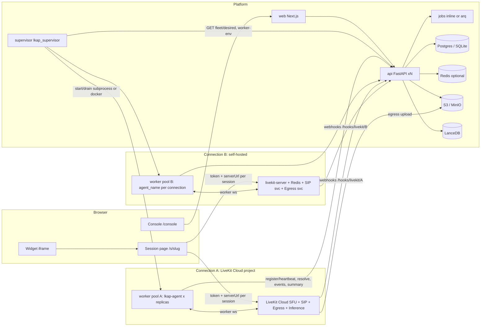
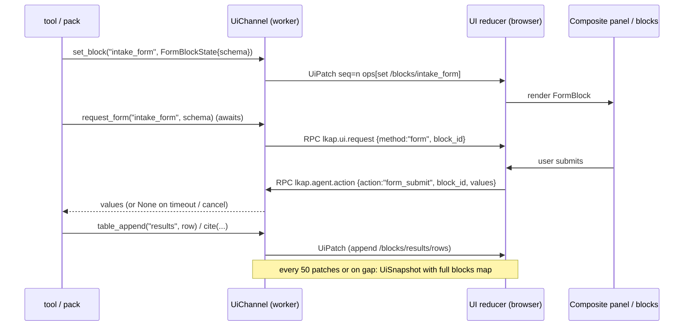
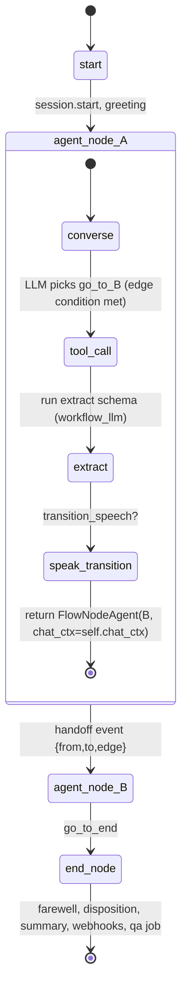

# LKAP v2 — Architecture and System Design

Status: **decided** (Fable 5.1, 2026-09-19). Written incrementally; each section is self-contained.
Precedence: `PLAN-V2.md` acceptance criteria > `CONTRACTS-V2.md` > this document > v1 docs (`../ARCHITECTURE.md`, `../CONTRACTS.md`, `../DECISIONS-W2.md`, `../REVIEW-FINAL.md`). Anything v1 decided that this document does not contradict still holds (in particular every D-W2-*/D-W3-* decision).

Inputs: `../research-v2/dograh.md`, `../research-v2/livekit-plugins-catalog.md`, `../research-v2/livekit-multi-deployment.md`, and the v1 briefs under `_briefs/`. Research claims marked UNVERIFIED there are treated as open items here, never as facts.

## 0. What v2 is

v1 is one FastAPI api, one Next.js web app and one LiveKit worker (`lkap-agent`) bound to one LiveKit Cloud project through environment variables, with a registry of ~17 constructible providers, two packs and two hand-written React panels.

v2 keeps every v1 runtime invariant that works (config fetched per job, explicit dispatch, registry-driven factory, seq-ordered UI state, Fernet vault, packs) and adds, in this order of importance:

1. **Connections** — LiveKit Cloud projects and self-hosted servers managed from the UI, each with its own worker pool, token minting, SIP/Egress and capability flags.
2. **Provider breadth** — every LiveKit Agents 1.8.2 plugin (STT, LLM, TTS, realtime, avatar, VAD, turn detection, noise cancellation) in the registry, enable/disable per workspace, credential tests and live model/voice/avatar catalogs, cascaded / realtime / half-cascade pipelines.
3. **Avatars in depth** — all 15 working avatar plugins with vendor-backed pickers and a verified core set.
4. **Panels** — a schema-driven block catalog so builders compose a session side panel without code; packs still register custom React panels.
5. **Production** — workspaces, users, roles, API keys, real auth, rate limits, Postgres, a job queue, S3 storage, CI, recordings, cost and latency, durable webhooks.
6. **Stretch (Phase 1 if capacity allows, else Phase 2 wave 1)** — the flow builder, LiveKit-native telephony core, text test mode with rewind, the embeddable widget.

Non-goals for v2: replacing LiveKit's transport, forking `agents-ui`, a K8s operator, vendor logos, i18n.

---

## 1. Decision register

Each decision: what we do, why, what was rejected. IDs are `D-V2-n`; work packages cite them.

### D-V2-1 Fleet topology: one worker pool per LiveKitConnection

- **Decision.** A worker pool serves **every agent bound to a connection**. v1 already runs one agent name (`lkap-agent`) for all agents because the worker fetches the resolved config per job from `DispatchMetadata.session_id`. So N connections = N pools, never N×M (connection × agent). Agents are **bound** to a connection (`agents.connection_id`), not deployed per agent.
- **Why.** `AgentServer` binds exactly one `(url, key, secret)` and one `rtc_session` (`../research-v2/livekit-multi-deployment.md` §1). Per-agent pools would multiply processes for no benefit; per-connection pools are the minimum the SDK forces and isolate failure domains (a dead self-hosted server never takes down Cloud agents).
- **Agent name per connection.** `connections.agent_name` (default `lkap-agent`) so a shared project with other agents (the current project hosts `other-project-agent`) never collides. The worker keeps D-W2-11 semantics: it refuses jobs whose name differs from its own configured name; the name now comes from `LKAP_AGENT_NAME` handed to the process by the supervisor (or env in `external` mode).
- **Rejected.** Multiple `AgentServer`s in one process (unsupported, port/pool duplication); one fat worker routing by dispatch metadata across connections (impossible: one URL per process).

### D-V2-2 Supervisor: a separate reconciler service with pluggable backends

- **Decision.** New Python service **`supervisor/` (`lkap_supervisor`)**. It runs a reconciliation loop: desired state from the api (`GET /internal/v1/fleet/desired`), actual state from a backend, converge. Backends in Phase 1: `subprocess` (dev, single host, `asyncio.create_subprocess_exec` of `python -m lkap_agent.main start`) and `docker` (prod, one container per pool replica via the Docker Engine API). `kubernetes` is deferred.
- **Credentials.** The supervisor never stores connection secrets. Per reconcile it calls `GET /internal/v1/connections/{id}/worker-env` (service token) which returns the decrypted `LIVEKIT_URL/API_KEY/API_SECRET` plus `LKAP_*` env; they are injected into the child environment only.
- **Rotation.** Rotating a connection's key/secret bumps `connections.credentials_version`; the desired-state hash changes; the supervisor drains (SIGINT, `drain_timeout`, then SIGKILL per D-W2-13) and restarts the pool. Hot rotation is impossible (`update_options()` refuses after `run()`).
- **Scaling.** `connections.replicas` (default 1). Replicas of one pool register under the same agent name and are load-balanced by LiveKit itself.
- **Why a separate service.** The api must stay stateless and horizontally scalable; a process manager inside uvicorn would tie worker lifetimes to api restarts and break with `--workers > 1`.
- **Rejected.** Supervisor inside the api (coupling); systemd units per connection (no dynamic add/remove from the UI); relying on `lk agent deploy` for everything (Cloud-only, Go-only client).

### D-V2-3 Three deployment modes per connection

`connections.deployment_mode`:

| Mode | Who runs the workers | Phase 1 support |
|---|---|---|
| `external` | An operator, outside the platform (today's `launch.json` worker, or `lk agent deploy` run by hand). The UI shows the exact env and commands. | Full. This is the v1 default connection's initial mode (zero-downtime migration, D-V2-6). |
| `supervised` | `lkap_supervisor` (subprocess or docker backend). "Start / stop / restart pool" buttons in the UI. | Full. |
| `cloud_hosted` | LiveKit Cloud agent hosting (`lk agent create/deploy`). Phase 1 generates a **deploy bundle** (per-connection working directory with its own `livekit.toml` and `secrets.env`) and shows the commands; the UI reads status by polling `lk agent list` output the operator pastes or, when the CLI is present on the api host, by running it. Phase 2 automates the Twirp calls. | Bundle + instructions only. |

Constraints stated once, here: `cloud_hosted` requires `deployment_type == cloud`; requires a **public HTTPS `LKAP_API_BASE_URL`** (RUNBOOK Stage 12 gap); the `lk` CLI cross-validates the project subdomain in `livekit.toml`, so every connection gets its own bundle directory; the bundle must never reference or redeploy `other-project-agent`.

### D-V2-4 LiveKitConnection entity and capability flags

- Fields: `id, workspace_id, name, slug, deployment_type (cloud|self_hosted), url, api_key (encrypted), api_secret (encrypted), credentials_version, agent_name, deployment_mode, replicas, worker_image (slim|full), region?, sip_uri?, storage_config_id?, is_default, status (unverified|ok|error), last_checked_at, last_error`.
- Capability flags, computed by **Test connection** and re-probed every 15 min by a job: `inference_available` (Cloud **and** the operator left the "use LiveKit Inference" toggle on), `sip_enabled` (SIP list call succeeds), `egress_enabled`, `ingress_enabled`, `cloud_hosting` (= cloud), `noise_cancellation_tier` (`none|ai_coustics|krisp`), `observability_dashboard` (= cloud), `turn_detector_mode` (`hosted|local`).
- Validation: `POST /v1/connections/{id}/test` runs `RoomService.list_rooms` with a 5 s timeout (primary), then the SIP/Egress/Ingress list probes (capability only, failures do not fail the test).
- **Flags gate validation, not just UI.** Agent save/publish validation rejects: `livekit-inference-*` providers on a connection with `inference_available=false`; Krisp NC on a non-Cloud connection; SIP features on `sip_enabled=false`. The worker receives the flags in `ResolvedAgentConfig.connection` and forces `inference.TurnDetector(version="v1-mini")` when `turn_detector_mode == local` (avoids the failed hosted attempt described in research §2.4).
- Rejected: auto-assuming Cloud ⇒ Inference (a Cloud project can be used with vendor keys only; the toggle makes billing explicit).

### D-V2-5 Session start across connections

`POST /v1/agents/{id_or_slug}/connect` resolves `agent → connection`, mints the participant token with **that connection's** key/secret, sets `RoomAgentDispatch(agent_name=connection.agent_name, metadata=DispatchMetadata)`, and returns `serverUrl=connection.url`. The browser is already URL-per-session (`web/src/lib/livekit.ts`), so no frontend change. `LiveKitAPI`/`AccessToken` instances are built per connection through `ConnectionClientFactory` with a short in-process cache keyed by `(connection_id, credentials_version)`.

Inbound SIP and other server-created rooms have no `connect` call, so **`DispatchMetadata` v2 carries `agent_id` and `channel`, and `session_id` becomes optional**; the worker calls `POST /internal/v1/sessions/start` (creates the row from `agent_id`, `channel`, room name and SIP participant attributes, returns `ResolvedAgentConfig`) when `session_id` is absent, and `GET /internal/v1/sessions/{id}/resolved` when present. This lands in the contracts package (V2-00) even though telephony is stretch, so the shape never changes later.

### D-V2-6 v1 migration: the default connection, zero downtime

On api startup (idempotent bootstrap, also runnable as `python -m lkap_api.bootstrap`): if `livekit_connections` is empty and `LIVEKIT_URL/API_KEY/API_SECRET` are set, create workspace `default`, user `owner@local` (password from `LKAP_BOOTSTRAP_OWNER_PASSWORD` or printed once), and connection `default` (`deployment_type` inferred from the URL suffix `.livekit.cloud`, `deployment_mode=external`, `agent_name=LKAP_AGENT_NAME or "lkap-agent"`, secrets encrypted with the vault). The migration backfills `workspace_id` and `connection_id` on every existing row. The worker started from `.claude/launch.json` keeps serving because its name and credentials are unchanged; `LKAP_CONNECTION_ID` unset ⇒ the worker attributes itself to the default connection when it registers (D-V2-9). Switching the default connection to `supervised` is a later, explicit UI action.

### D-V2-7 Provider registry at full breadth

- `ProviderKind` += `vad`, `turn_detection`, `noise_cancellation`. `FieldType` += `file` (upload → stored asset → path/URL kwarg), `catalog` (value chosen from a vendor list API, with free-text escape).
- `ProviderSpec.status` (`mvp|deferred`) is replaced by three orthogonal fields: `availability: available|deferred|incompatible|removed`, `verification: verified|unverified` (with `verified_at`, `verified_note`), `worker_image: slim|full|isolated`. `status` stays for one release as a **derived read-only alias** (`mvp` iff `availability=available and verification=verified`) so existing consumers (`mvp_providers()`, `_deferred()`, the web `status === "mvp"` filter, pack seeding) keep working while web WPs migrate.
- Entries: every plugin from the catalog (~90 entries). Hedra is `removed` (vendor-disabled). MiniMax is `incompatible` (pins `livekit-agents==1.2.9`) with a note; no isolated image in Phase 1. PlayAI is `deferred` (stale, unverified against core). Non-provider packages (langchain, browser, hamming, nltk, minimal, blockguard, durable) are not registered.
- **Verified at Phase 1 start** = exactly what has passed a live call on this platform: `livekit-inference-stt`, `livekit-inference-llm`, `livekit-inference-tts` and `fastembed-embedding` (RUNBOOK stages 0–9). Vendor-key plugins, realtime models and avatars were never live-tested in v1 (F-34), so they start `unverified` and flip only in V2-20 with the user's keys.
- Registry gains `catalog: CatalogSpec | None` (how to list models/voices/avatars from the vendor) and `capabilities` gains `text_modality` (half-cascade capable realtime), `languages`, `vision`, `streaming`, `voices_dynamic`.
- Why: one schema, one export, one factory. Rejected: per-vendor Python subclasses in the factory (unbounded special cases); a separate avatar registry.

### D-V2-8 Worker images and "installed" attribution

- Two images from one Dockerfile with a build arg: **`slim`** (v1 plugin set + silero + turn-detector; dev default) and **`full`** (every 1.8.2-lockstep plugin that resolves together per catalog §4.1, minus minimax/playai/hedra; Python 3.12; `python:3.12-slim-bookworm`, glibc 2.36 ≥ manylinux_2_28 for bithuman/Krisp wheels; no Windows target).
- The build gate is `scripts/check_installed_providers.py`: import every `python_class` of every `availability=available` entry whose `worker_image` ≤ the image flavor, and write `installed_providers.json` into the image. uv resolving is not the acceptance criterion; importing is.
- On start the worker calls `POST /internal/v1/workers/register` with `connection_id` (`LKAP_CONNECTION_ID`, unset ⇒ default connection), `image`, `installed_provider_ids`, `sdk_version`, and heartbeats every 30 s. The api stores `worker_instances` and exposes per-connection `installed_provider_ids`; the UI greys out providers the bound connection's pool cannot construct and validation errors on save.

### D-V2-9 Workspace-level provider enablement, credential tests, catalogs

- `workspace_providers(workspace_id, provider_id, enabled, default_credential_id)`. Disabled providers are hidden from slot pickers and rejected at validation.
- `POST /v1/credentials/{id}/test` runs the provider's `test_call` (registry `CatalogSpec.test` or the existing `_TEST_CALLS`), 10 s timeout, result cached 10 min.
- `GET /v1/providers/{id}/catalog?kind=models|voices|avatars|personas&credential_id=` runs a vendor adapter (`api/src/lkap_api/catalogs/<vendor>.py`), cached 1 h in Redis when present else in-process LRU, with `refresh=true` to bypass. Phase 1 adapters: OpenAI, Anthropic, Google (Gemini API), Groq, Mistral, Cerebras, Perplexity, Deepgram, ElevenLabs (voices + models), Cartesia, Hume, Speechify, Polly, Azure Speech; avatars: Beyond Presence, Tavus (faces + pals), Simli, Anam (avatars + personas), D-ID, LiveAvatar. Vendors without a confirmed list API use `catalog=None` and a free-text id field.

### D-V2-10 Pipeline modes: cascaded, realtime, half-cascade

`PipelineConfig.mode: cascaded | realtime | half_cascade`. Half-cascade = realtime model with text output (`modalities=["TEXT"]`, `output_medium="text"`, etc.) + a `tts` slot, valid only when the realtime provider has `capabilities.text_modality=true` (Gemini Live, OpenAI Realtime/Azure, Ultravox; not Nova Sonic, xAI, Phonic). New optional slots: `vad`, `turn_detection`, `noise_cancellation`. Defaults keep v1 behaviour (silero VAD prewarmed; `inference.TurnDetector` in cascaded/half-cascade only; none in realtime).

### D-V2-11 Avatars

- All 15 working plugins registered with AST-verified kwargs (catalog §2.1); Hedra removed. `PipelineConfig.avatar` stays a `ProviderRef`; `AvatarOptions` (new, on `PipelineConfig`) adds `participant_name`, `video_quality`, `idle_timeout_s`, `max_duration_s` where the vendor supports them.
- Pickers: `catalog` fields for bey (`avatar_id`), tavus (`face_id`, `pal_id`), simli (`simli_config.face_id`), anam (`persona_config.avatarId`), d-id (`agent_id`), liveavatar (`avatar_id`); paste-id for the rest. `required=true` for D-ID `agent_id` and Synthesia `avatar_config`.
- Runtime: unchanged D-W2-9b ordering `avatar.start(session, room)` → `wait_for_join()` → `session.start(...)`; avatars work with all three pipeline modes because they consume the agent's published audio. Audio routing requirement: the agent must publish audio (never `audio_output=False`); `RoomOutputOptions.audio_enabled` stays true and the avatar plugin republishes on behalf (`lk.publish_on_behalf`). D-W2-7 identity exclusion stays.
- Frontend: `useVoiceAssistant().videoTrack` already renders the avatar; v2 adds a `video` block and the stage layout `avatar` preset.
- Verified in MVP: **Beyond Presence and Tavus** become `verified` in V2-20 (stage L13, blocked on the user's keys; neither has ever been live-tested — RUNBOOK stage 10 was not run), plus Simli and Anam if keys are provided. Everything else stays `unverified`.

### D-V2-12 Panels: schema-driven blocks over the existing envelope

- `AgentConfig.panel: PanelLayout` = `{panel_id: "composite" | <custom id>, layout: side|wide, blocks: BlockSpec[]}`; `BlockSpec = {id, type, title?, config, order}`. Block types (Phase 1): `status`, `notes`, `checklist`, `activity`, `form`, `document`, `gallery`, `table`, `transcript`, `video`, `kb_citations`, `custom`. Phase 2: `whiteboard`, `map`, `chart`.
- `UiState` gains `blocks: dict[block_id, dict]` beside `custom`; block state shapes are Pydantic models exported to TS. The patch protocol is unchanged (`path=/blocks/<id>/...`).
- `UiChannel` gains `block(id)` helpers and a `form` RPC (`UiRequest.method="form"` → browser returns submitted values). Built-in tools: `update_block`, `show_document`, `table_append`, `request_form`, `cite_sources` (auto-called by `search_knowledge` when a `kb_citations` block exists).
- Custom React panels keep the v1 `PanelDefinition`; they may render `<Block>` components inside. Packs may declare `default_panel: PanelLayout` in their manifest.
- Migration of v1 `ui_panel_id`: `generic` → `panel_id="composite"` with the four default blocks (`status`, `notes`, `checklist`, `activity`, in that order); any other id (e.g. `insurance_notebook`) is kept as a custom panel id with `blocks=[]`.
- Rejected: a fully dynamic JSON-rendered UI (no way to keep the notebook's quality); separate data channels per block (ordering guarantees are the envelope's whole point).

### D-V2-13 Flow builder (stretch)

- Adopt a Dograh-style graph. `AgentConfig.flow: FlowSpec | None`; `agents.mode: prompt | flow` (prompt stays the default path). `FlowSpec = {nodes, edges, variables, global}`; node kinds Phase 1: `start`, `agent`, `end`, `global` (single, no edges), `transfer` (stretch, telephony), `qa` (post-call, no edges). Edges: `{from, to, condition (natural language), transition_speech?, label}`.
- Runtime mapping: each `agent` node is a `FlowNodeAgent(PlatformAgent)` with its own instructions (global prefix + node prompt), tool subset, KB subset and **provider overrides in cascaded mode only** (LLM, TTS via `Agent(llm=, tts=)`); realtime/half-cascade flows use one model and vary instructions/tools/KB per node. Edges become generated tools `go_to_<node_id>` whose description is the condition; the tool returns the next node's Agent (LiveKit handoff) after optionally speaking `transition_speech`. `chat_ctx` is **carried** (`chat_ctx=self.chat_ctx`), not copied, so the caller never repeats themselves; `session.userdata.flow` holds `variables`, `path`, `disposition`. Variable extraction: `node.extract: {schema}` runs the structured `workflow_llm` on node exit. `AgentTask` sub-flows and loops are Phase 2.
- One schema drives everything: `FlowSpec` JSON schema is exported with the contracts and consumed by the UI forms (`useNodeSpecs` analog), the REST API and the Phase 2 MCP server.
- Versioning: `agent_config_versions(agent_id, config_version, config, created_by, created_at)` snapshots on every save, for both prompt and flow agents; diff view in the UI.

### D-V2-14 Telephony via LiveKit SIP (stretch)

Per connection: SIP trunks (inbound/outbound, stored as LiveKit trunk ids + our metadata), dispatch rules (number → agent, via `RoomAgentDispatch` metadata with `agent_id`, `channel=sip`), inbound sessions created by the worker (D-V2-5), outbound single calls (`CreateSIPParticipant` from the console/API, `wait_until_answered`), DTMF receive (`sip.dtmf` room events → `on_dtmf` tool hook) and send (`publish_dtmf`), cold transfer (`transfer_sip_participant`, REFER). Phase 2: campaigns (CSV, pacing, retries, schedules, circuit breaker on a job queue with Redis concurrency slots), AMD (carrier flag + transcript classifier), warm transfer (conference room + summary), voicemail drop. Self-hosted connections need the separate SIP service; `sip_enabled` gates everything.

### D-V2-15 Testing and evals

Phase 1 core: post-call **QA scoring** (`agents.qa: QaConfig {enabled, rubric_prompt, model}`) — the judge runs **in the worker** right after the summary is posted (that is the only place LiveKit Inference is callable; R-V2-5 in PLAN §8), the api keeps a re-score path for vendor-key judges — writing `session_qa(score, tags, sentiment, summary, raw)`; results in the session detail and webhook payload; JSON output validated with one repair retry (avoids Dograh's truncated-grade bug). Stretch: **text test mode** — a session with `channel=text` where the worker starts `AgentSession` with `audio_input/output=False` and `text_input=True`; **rewind** = the browser sends `AgentAction(action="rewind", payload={turn_index})` and the worker truncates `chat_ctx` and regenerates. Phase 2: simulated caller (second worker persona with its own LLM+TTS joining the room) + LLM judge, scenario suites, regression runs in CI.

### D-V2-16 Observability, cost, recordings, webhooks

- `sessions` += `workspace_id, connection_id, channel (web|test|text|sip|widget|api), recording_url, cost_usd, latency` (p50/p95 of `metrics_collected` EOU→first-audio, LLM TTFT, TTS TTFB — v2 does consume `metrics_collected`, superseding D-W2-9c's "unused").
- **Recordings**: `RoomCompositeEgress` audio-only (MP4/OGG) to the connection's `storage_configs` (S3-compatible; MinIO in dev). The room only exists once a participant joins, so the **worker** triggers it: after `ctx.connect()` it calls `POST /internal/v1/sessions/{id}/recording/start` and the api issues the egress request with that connection's client. Finalisation: the `egress_ended` webhook when `LKAP_PUBLIC_BASE_URL` is reachable, otherwise the worker polls `list_egress` in its shutdown callback and posts the result. Signed URLs for playback.
- **Cost**: `contracts/pricing.py` price table (per provider/model, per unit) × real usage from `session_usage_updated` + Egress minutes + avatar minutes ⇒ `session_costs` rows; the price table is versioned and editable per workspace (override table).
- **OTel**: `LKAP_OTEL_EXPORTER_OTLP_ENDPOINT` etc. on api and worker using LiveKit 1.8's GenAI semantic conventions; Langfuse/Datadog are just OTLP targets. Prometheus `/metrics` on api and supervisor.
- **Outbound webhooks**: `webhook_endpoints(workspace_id, url, secret, events[], enabled)`; `webhook_deliveries` with HMAC-SHA256 signature header, exponential retries via the job queue, dead-letter after 8 attempts, redelivery from the UI. Events: `session.started/ended`, `session.qa_completed`, `recording.ready`, `call.*`.

### D-V2-17 Distribution (stretch)

Widget: `<script src="/widget.js" data-agent="slug" data-mode="floating|inline">` that mounts an iframe of `/s/[slug]?embed=1` and bridges `postMessage` (`open/close/state`); headless JS API Phase 2. Gated by **per-agent `allowed_origins`**, per-IP and per-agent rate limits, `max_concurrent_sessions`, `max_session_duration_s` (closes F-07) — these ship before the widget. Public REST API = the same `/v1` routes authenticated by API keys; MCP server (workflow authoring for coding agents) Phase 2, trivial once `FlowSpec` schema exists.

### D-V2-18 Production readiness

- **Tenancy**: `workspaces`, `users`, `workspace_members(role: owner|admin|builder|viewer)`, `api_keys(hash, prefix, scopes)`. Every table gains `workspace_id`; every query is scoped by a `WorkspaceContext` dependency (never by convention alone: a SQLAlchemy `before_compile` guard rejects unscoped selects on tenant tables in tests).
- **Auth** Phase 1: email + password (argon2), HttpOnly cookie session (JWT, 12 h, refresh), Next.js middleware protects `/console`; the console proxy forwards the cookie instead of the static admin token; `?mode=test` requires a `builder` role (closes F-06). `LKAP_ADMIN_TOKEN` becomes break-glass (only if `LKAP_ALLOW_ADMIN_TOKEN=true`). OIDC/SSO Phase 2.
- **Rate limits**: per-IP and per-agent on `connect`, per-key on the public API; Redis-backed when `LKAP_REDIS_URL` is set, in-memory otherwise.
- **Jobs**: `LKAP_JOBS_BACKEND=inline|arq`. `inline` reuses FastAPI `BackgroundTasks` (dev, no Redis); `arq` + Redis in prod. Job kinds: KB ingest, QA scoring, webhook delivery, connection probes, catalog refresh, recording finalize.
- **Database**: Postgres in prod (`asyncpg`), SQLite in dev; all migrations run on both (CI runs the suite on both).
- **Storage**: S3-compatible via `aioboto3` (`LKAP_STORAGE_*`); local filesystem backend in dev.
- **Secrets**: process env from the host's secret manager (compose `env_file`, or K8s secrets later); `.claude/launch.json` stays dev-only and outside the repo; `LKAP_MASTER_KEY` rotation gets a `python -m lkap_api.keys rotate --old --new` re-encryption command.
- **CI**: GitHub Actions — Python gates per package (ruff, format, mypy --strict, pytest not-live on SQLite and Postgres service), web gates, contracts export diff, Docker builds of api/web/agent(slim), the installed-providers import check for `full` on a nightly job.
- **Deployment topology**: compose files for `dev` (api, web, supervisor, minio, redis optional) and `prod` (api ×N behind a reverse proxy, web, supervisor ×1 with a Redis lease, Postgres, Redis, MinIO/S3); workers as containers created by the supervisor. Backups: `pg_dump` nightly + S3 versioning; LanceDB directory in the same backup set.
- Everything from REVIEW-FINAL §5 is mapped to a package in `PLAN-V2.md` §"Before-production map".

### D-V2-19 What stays exactly as in v1

Explicit dispatch and the job-name filter; per-job config fetch; the seq-ordered UI envelope and snapshot cadence; Fernet vault semantics (decrypt only inside the api); the pack protocol (`manifest.py` + `pack.py`); the console proxy pattern (now cookie-forwarding); the session bundle budget (≤400 kB); the WP-0 design system.

---
## 2. Diagrams

### 2.1 Topology: supervisor, connections, pools



### 2.2 Session start across connections (web) and inbound SIP

```mermaid
sequenceDiagram
  participant B as Browser
  participant API as api
  participant LK as LiveKit (connection of the agent)
  participant W as worker pool (that connection)
  B->>API: POST /v1/agents/{slug}/connect (origin, limits checked)
  API->>API: agent -> connection; mint token with connection key/secret; RoomAgentDispatch(agent_name=connection.agent_name, metadata{v:2, session_id, agent_id, channel:web, connection_id})
  API->>API: sessions row (created); if recording.enabled schedule egress start on room_started
  API-->>B: {serverUrl: connection.url, participantToken, sessionId, ...}
  B->>LK: connect(serverUrl, token)
  LK->>W: job request (agent_name matches) -> accept
  W->>API: GET /internal/v1/sessions/{id}/resolved
  API-->>W: ResolvedAgentConfig{connection, panel, recording, ...}
  W->>W: build providers (flags: inference/turn detector mode), avatar.start, session.start
  W-->>B: UiSnapshot seq=1 (blocks)
  Note over LK,W: Inbound SIP: LiveKit dispatch rule creates the room with metadata{agent_id, channel:sip_in, session_id:null}
  W->>API: POST /internal/v1/sessions/start {agent_id, room_name, channel, caller}
  API-->>W: ResolvedAgentConfig (row created)
```

### 2.3 Provider and avatar factory

```mermaid
flowchart TB
  REG[(REGISTRY v2: ProviderSpec.kind, python_class, fields, capabilities, worker_image, catalog)]
  CFG[AgentConfig v2 pipeline: mode + slots + avatar_options]
  VAL[api validate: kind match, credential, enabled, installed on connection pool, connection flags, text_modality for half_cascade, vision warnings]
  RES[ResolvedAgentConfig.resolved: slot -> {python_class, model, kwargs}]
  FAC[ProviderFactory: lazy import, special cases]
  SC1[inference-*: strip api_key/secret; TurnDetector version from connection.turn_detector_mode]
  SC2[google: credentials_info/file; realtime modalities TEXT for half_cascade]
  SC3[openai/xai/ultravox: modalities/output_medium; azure overload via with_azure]
  SC4[avatars: nested configs (Simli SimliConfig, Anam PersonaConfig), positional (Synthesia), required ids (D-ID)]
  AV[avatar.start(session, room) -> wait_for_join -> session.start]
  REG --> VAL
  CFG --> VAL --> RES --> FAC
  FAC --> SC1 & SC2 & SC3 & SC4
  SC4 --> AV
```

### 2.4 Panel protocol v2



### 2.5 Flow runtime (stretch)



### 2.6 SIP call flow (stretch)

```mermaid
sequenceDiagram
  participant C as Caller / PSTN
  participant SIP as LiveKit SIP (per connection)
  participant LK as LiveKit room
  participant W as worker
  participant API as api
  C->>SIP: INVITE to number
  SIP->>SIP: match inbound trunk + dispatch rule -> room prefix + agent dispatch metadata{agent_id, channel:sip_in}
  SIP->>LK: create room, SIP participant (attributes sip.callID, sip.phoneNumber, sip.trunkID)
  LK->>W: job -> accept
  W->>API: POST /internal/v1/sessions/start {agent_id, caller from attributes}
  API-->>W: ResolvedAgentConfig
  W->>LK: session.start; DTMF events -> on_dtmf; publish_dtmf on request
  W->>API: transfer request -> API: SipService.transfer_sip_participant (REFER)
  Note over API,SIP: Outbound: POST /v1/calls -> CreateSIPParticipant(outbound trunk, wait_until_answered) with dispatch metadata{channel:sip_out}
```

## 3. Deferred list (decided out of Phase 1)

| Item | Phase | Reason |
|---|---|---|
| Automated `cloud_hosted` deploy (Twirp/`cloudagents`) | 2 | Go-only client (UNVERIFIED Python equivalent); bundle + CLI covers the need. |
| Kubernetes supervisor backend, Helm | 2/3 | No concrete demand; docker backend suffices; Dograh's own Helm is alpha. |
| MiniMax TTS isolated image | 2 | Pins `livekit-agents==1.2.9`; wait for vendor. |
| PlayAI TTS | 2 | Stale out-of-tree plugin. |
| Campaigns, AMD/voicemail, warm transfer, voicemail drop | 2 | Needs telephony core first + Redis concurrency slots. |
| Simulated-caller evals, LLM judge on scenarios, regression suites in CI | 2 | Design fixed now (second persona worker + judge); build after text mode. |
| MCP authoring server | 2 | Trivial once FlowSpec schema + API keys exist. |
| Headless widget JS API | 2 | Floating/inline iframe first. |
| OIDC / SSO, SCIM | 2 | Email+password + invites first. |
| Whiteboard, map, chart, flow-progress blocks | 2 | Composite panel + 12 blocks first. |
| `AgentTask` sub-flows, loops, parallel branches | 2 | After the linear graph is proven. |
| Master-key rotation UI, credential rotation UI for vendor keys | 2 | CLI command ships in Phase 1. |
| Langfuse/Datadog presets UI | 2 | OTel env works now. |
| Multi-region routing, per-workspace price overrides UI, billing export | 3 | |
| Pack marketplace, scaffold CLI, shared fakes as a published package | 3 | Fakes package is internal in Phase 1. |
| Ingress sources as video blocks, Palabra translation pipelines, browser tool plugin | 3 | |
| On-prem avatar runtimes (bitHuman local `.imx`) | 3 | Registry entry exists; local mode untested. |
| Windows worker images | never | No bithuman/Krisp wheels. |

---
